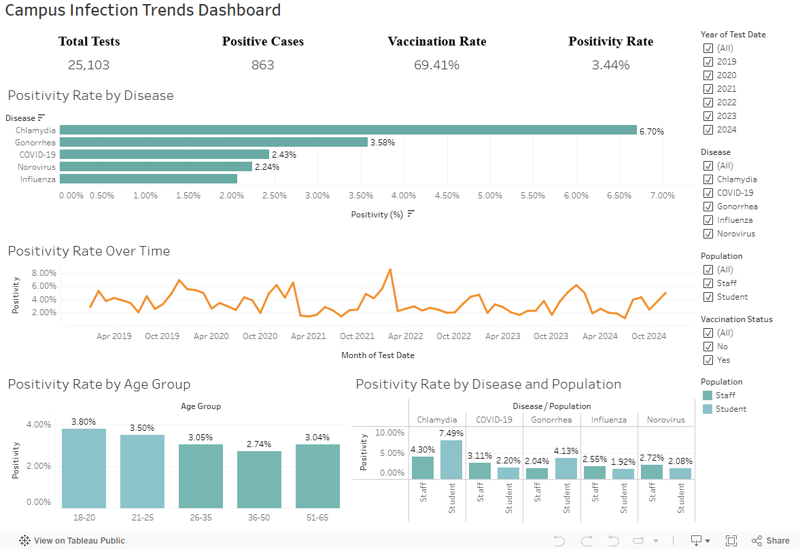

# Executive Summary: Campus Infectious Disease Trends Dashboard

**University Campus Health Surveillance (2019–2024)**

**Prepared by:** Ari M.

**Data Scope:** 25,103 test records across five infectious diseases (Chlamydia, Gonorrhea, COVID-19, Influenza, Norovirus)

---

## 1. Context

The university health service required a consolidated view of infectious disease activity across campus to better understand infection patterns, identify at-risk groups, and evaluate the potential relationship between vaccination coverage and positivity outcomes.

Prior to this work, data existed in separate systems (patient records, lab results, and vaccination logs), limiting the ability to conduct consistent cross-disease or population-level analysis. This project was designed to unify these datasets and deliver an interactive Tableau dashboard to support ongoing public health monitoring and decision-making.

## 2. Key Metrics

- Total tests: 25,103
- Positive cases: 863
- Overall positivity rate: 3.44%
- Vaccination coverage: 69.41%

Figure 1. Campus Infection Trends Dashboard showing positivity rates by disease, age group, vaccination status, and time (2019–2024).

## 3. Key Findings

### 3.1 Disease-level variation is significant

Positivity rates vary meaningfully by disease. Chlamydia consistently shows the highest positivity rate (~6.7%), followed by Gonorrhea (~3.6%). Respiratory and gastrointestinal illnesses such as Influenza, COVID-19, and Norovirus remain comparatively lower (2–2.5%).

This pattern suggests differences in testing behavior and exposure, as reflected in the consistently higher positivity rates for Chlamydia (~6.7%) and Gonorrhea (~3.6%) compared to other diseases (~2–2.5%).

### 3.2 Temporal trends show episodic spikes

Across 2019–2024, positivity rates remain relatively stable overall, with periodic spikes in specific months. These peaks are not consistent across diseases, indicating that infection dynamics are event-driven rather than steadily increasing or decreasing over time.

COVID-19 shows higher month-to-month volatility during 2020–2021, with visible spikes in early pandemic periods before stabilizing in later years, while other diseases remain relatively stable.

### 3.3 Age distribution highlights student population exposure

The highest positivity concentration appears in the 18–25 age groups, which aligns with the student population. Staff populations show lower and more stable positivity rates across most diseases.

Older age groups show slightly elevated variation in specific diseases such as Influenza (26–65), and COVID-19 (51-65).

### 3.4 Vaccination shows limited standalone impact

Vaccination coverage for Influenza and COVID-19 is approximately 69%, however the difference in positivity between vaccinated and unvaccinated groups is minimal in aggregate terms.

This suggests vaccination status alone is not a strong predictor of infection outcome in this dataset without further stratification by disease type and demographic factors.

## 4. Interpretation of Overall Risk Pattern

Campus infection risk appears generally low but unevenly distributed across diseases and population groups. The data suggests infection risk is driven by multiple factors rather than a single dominant cause.

Sexually transmitted infections such as Chlamydia (~6.7%) and Gonorrhea (~3.6%) show higher positivity rates than respiratory and gastrointestinal diseases (~2–2.5%), suggesting a more targeted testing and exposure pattern.

Students, particularly those aged 18–25, account for the majority of positive cases, aligning with higher-density exposure patterns within the campus population. Staff remain relatively stable across both time and disease categories.

While overall vaccination coverage is high (~69%), its impact on positivity rates is limited at an aggregate level, likely due to its restriction to Influenza and COVID-19 only.

Overall, the findings suggest that campus health risk is best managed through targeted, disease-specific interventions, supported by ongoing monitoring of time trends and subgroup-level patterns to identify emerging risk clusters early.

## 5. Key Limitations

- Dataset is simulated and does not fully represent real epidemiological conditions
- Testing frequency is not uniform across individuals or groups
- Vaccination data is only available for Influenza and COVID-19, which limits cross-disease comparability
- Behavioral and environmental exposure factors are not captured (Mask usage, outbreak exposure history, such as events or gatherings)

## 6. Practical Implications

The analysis indicates that infection risk on campus is primarily driven by disease type and demographic exposure patterns rather than a single uniform driver such as vaccination status.

For public health planning, this supports a more targeted approach:

- STI prevention strategies for student populations
- Continued monitoring of respiratory illness seasonality
- More granular vaccination effectiveness analysis by disease type

## 7. Conclusion

This project demonstrates the value of integrating fragmented health datasets into a unified analytical framework. The resulting dashboard enables ongoing monitoring of infection trends across diseases, populations, and time periods.

Overall, the campus demonstrates relatively stable observed positivity trends for acute viral diseases but continues to face persistent higher STI transmission challenges. The strongest opportunity lies not in broad-based interventions, but in targeted, population-specific interventions focused on behaviors and seasonal risk windows. This dashboard provides a scalable foundation for moving from reactive response to proactive prevention.
